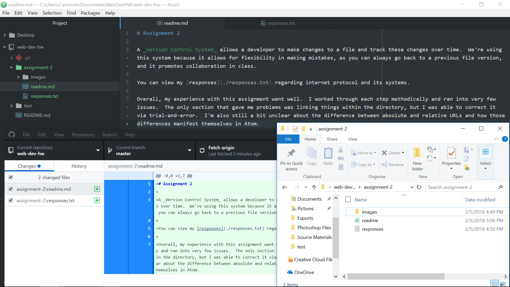

# Assignment 2

A _Version Control System_ allows a developer to make changes to a file and track these changes over time.  We're using this system because it allows for flexibility in making mistakes, as you can always go back to a previous file version, and it promotes collaboration in class.

You can view my [responses](./responses.txt) regarding internet protocol and its systems.

Overall, my experience with this assignment went well.  I worked through each step methodically and ran into very few issues.  The only section that gave me problems was linking things within the directory, but I was able to correct it via trial-and-error.  I'm also still a bit unclear about the difference between absolute and relative URLs and how those differences manifest themselves in Atom.

