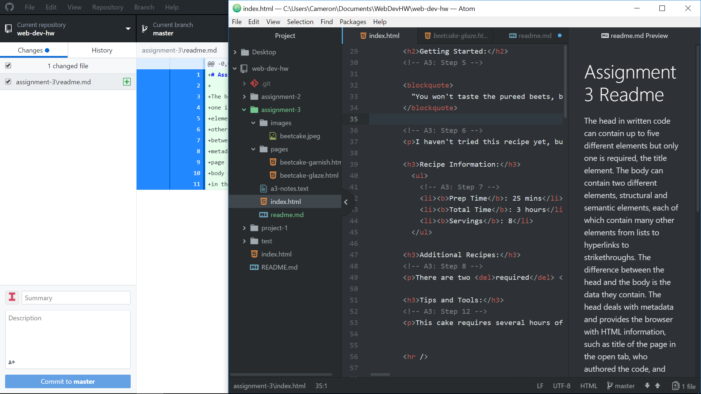

# Assignment 3 Readme

The head in written code can contain up to five different elements but only
one is required, the title element.  The body can contain two different
elements, structural and semantic elements, each of which contain many
other elements from lists to hyperlinks to strikethroughs.  The difference
between the head and the body is the data they contain.  The head deals with
metadata and provides the browser with HTML information, such as title of the
page in the open tab, who authored the code, and when it was published.  The
body deals with all the other content that will be displayed to the user
in the browser window, such as text, pictures, links, and so on.

Structural markups provide the structure for the webpage via headers, paragraphs, breaks, and lists.  These structural markups also help guide the user throughout the webpage and provides data about the content.  Semantic markups are used to enhance and provide additional meaning to the content, such as bolding or italicizing a certain word or phrase.

My experience with this assignment was good overall.  I found I worked better in short bursts (15 to 20 minutes at a time) and saving after each step was completed, it helped me keep track of my work and kept  I found having index.html, garnish.html, and glaze.html open all at once somewhat confusing but after some time with it I was able to corral them all in my head.  The only real issue I encountered was with the email link.  Clicking on it produced a 404 error page.  After reviewing the course work again, I found out that I had forgot to put the "mailto:" tag before the email address.

