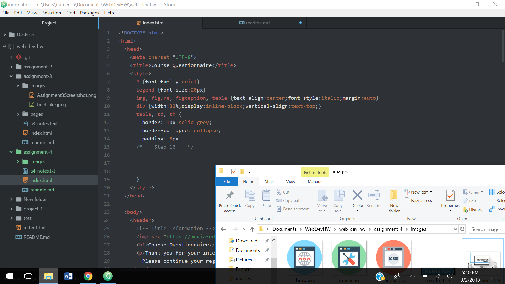

# Assignment 4 Readme

"Alt text" is an attribute that helps describe an image.  It's used by screen readers to help those with poor vision.

I've ran across pretty much all forms described in the lesson while browsing the web, ranging from drop down menus to password inputs to online polls.  The forms help web developers collect information from those using their websites.

The work cycle for this assignment was pretty painless.  I didn't run into any issues really, but I did find this coding pretty time consuming, especially while building the tables.  When I first started it, I was definitely confused about how "inputs" actually worked but I found that they made more sense the more I used them.  The few issues I did run into I was able to recognize what I had done wrong and self-corrected them.

