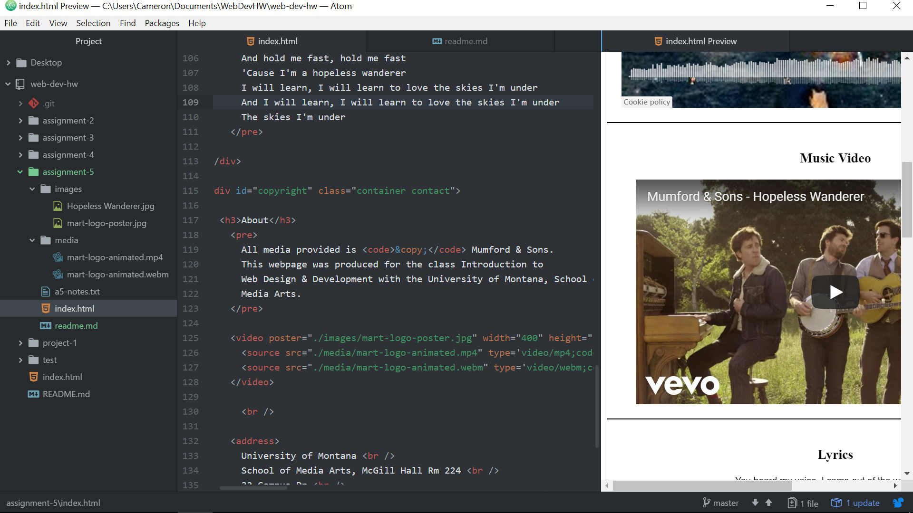

# Assignment 5 Readme

ID attributes provide a unique identifier for a specific element.  This contrasts with Class attributes which group together similar elements under a unique identifier.  The Div element is a block-level element that groups together other elements and provides structure and readability for a page.  Span elements exist within Div elements and group elements together within the Div.

Third-party hosting has several advantages over self-hosting, mainly that it can be more affordable if you're hosting a video or large file that requires a lot of bandwidth and it can handle any encoding/compatibility needed to run the media across a variety of browsers.

Assignment 5 was fairly trouble free overall but I did run into issues getting the text to center across the whole page, due to mistakenly adding a period before "body" in the style element in the head.  I had thought it was a copy and paste error.  Once that was remedied, I found the rest of the coding to be pretty straight forward.  I particularly liked how media that can be shared has the embed code that you can plug right into your website.

