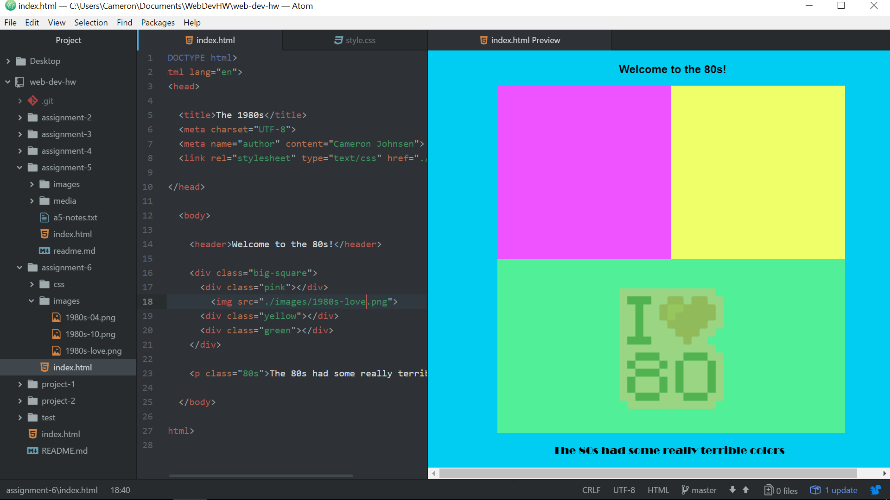

# Assignment 6 Readme

I chose the 1980s era due to a mixture of nostalgia and the hilarity of how ridiculous it was.  I kept it very simple and angular, almost like the 8-bit graphics of Nintendo in the 1980s.

I chose a color palette consisting of bright, pastel colors that epitomized the 80s.  I specifically chose teal (rgb(0, 205, 241)), pink (rgb(239, 82, 255)), yellow (rgb(238, 255, 105)), and an opaque green (rgba(116, 255, 115, 0.7).

I found this assignment to be quite difficult.  I struggled a lot with CSS, particularly with positioning in relation to the browser size and chaining (still confused on how it works or how to use it).  I attempted to get one-on-one help at the computer lab but the advertised hours didn't seem to be accurate (someone was supposed to be there at 10 AM) so I was unable to figure out what I was doing wrong.

