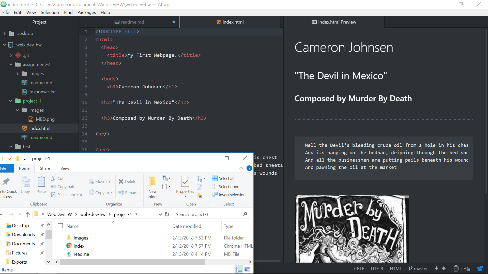

# Project 1 Readme

Personally, I mainly use Chrome and Firefox for browsing the internet.
Browsers mainly function as a means to interpret and display whatever files
you've requested from the servers. It accomplishes this via several components,
to include a user interface, a rendering engine, a browser engine, network functions,
JavaScript interpreters, and data storage.

Using the Wayback Machine, I looked at the gaming website ign.com in July 2000.
At that time the website was very text heavy, contained simple thumbnail pictures,
and was arranged in a tiled manner.  This is a far cry from the present website, which is far more fluid and graphically heavy, with an emphasis on interactivity.

For this work cycle, I built a website solely using HTML.  I found this to actually be more intuitive than Markdown, as I've had a bit of experience with HTML.  The only issue I ran into concerned getting the required image to appear.  For the relative URL I was putting too much information into the file path, using ./project-1/images/MBD.png instead of ./images/MBD.png

