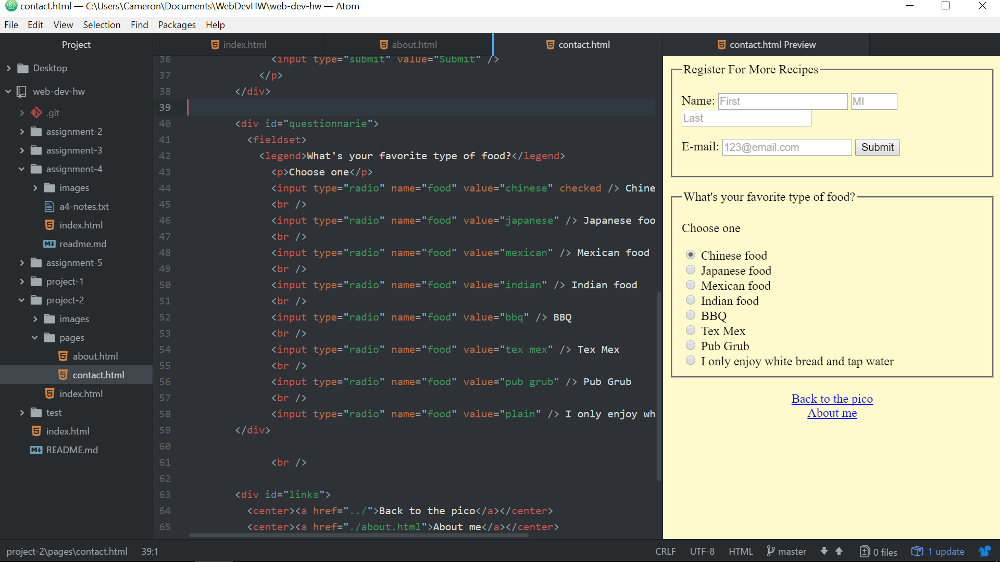

# Project 2 Readme

Learning HTML was both interesting and frustrating at the same time.  I enjoyed seeing my code being translated onto the web browser but the constant attention to detail could be infuriating and skimming through trying to locate mistakes could be time consuming.  I found the style elements in the header portion to be difficult to grasp, not so much the concept of what they do, but how to actually properly implement them.

I'm looking forward to learning CSS as it seems to be a bit more intuitive and streamlined.

This project definitely challenged me.  I'll be the first to admit that I put it off until the day it was due, so there was a sort of a scramble that was completely self-inflicted.  Fortunately, most of the coding went pretty smoothly.  The biggest snag I hit was constructing the table with the photos embedded in them correctly, along with getting certain style elements to correctly appear.  I was able to use outside resources and YouTube videos to help me through the areas I was getting stuck on.  I did find that some of instructional resources were quite out of date, with HTML5 being the dominant HTML code now, and most recommended using CSS.

